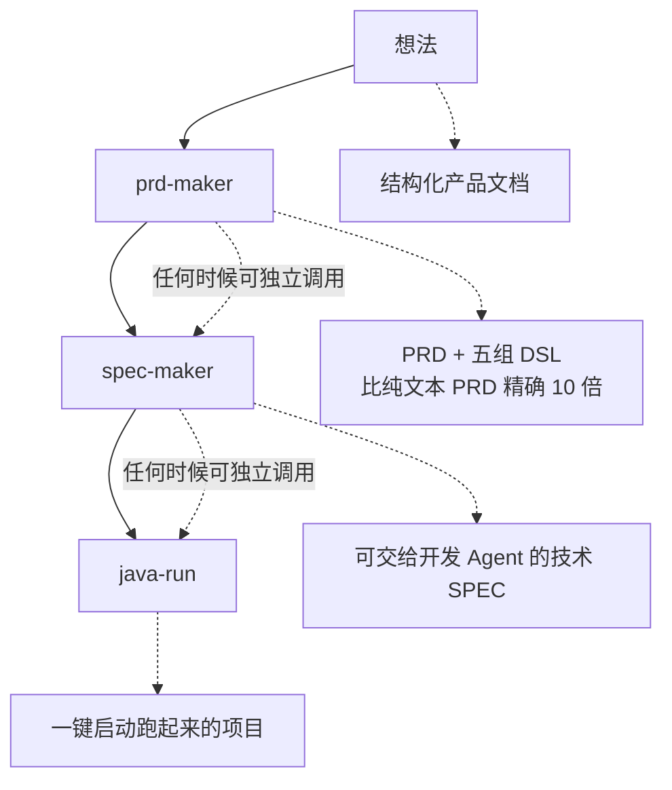

# imc-skill

基于 ASA（Agent Specification Architecture）范式构建的个人 Claude Code 技能集。每个 Skill = Identity → Policy → State Machine → Planner → Verify → Knowledge Index，模板与实现细节按需拆分到 knowledge/，模型按任务复杂度推荐（推理型 generative → Sonnet，提取型 generative → Haiku/Sonnet，orchestration → Sonnet/Opus）。

> 详见 [Agent-Specification-Architecture.md](Agent-Specification-Architecture.md) — ASA 范式的完整设计文档（七层模型、设计原则、验证清单、Agent Compiler 愿景）。

## 安装

```bash
cp -r <skill-name> ~/.claude/skills/
```

## 技能列表

### prd-maker — 产品需求文档生成器
**何时用**：你有一个模糊的产品想法，需要把它变成一份结构完整、逻辑闭环的 PRD。
**做什么**：解构想法 → 推演业务闭环 → 输出含用户画像、功能矩阵（P0/P1/P2）、Given-When-Then 验收标准的 PRD，同时生成术语表、状态机、规则、能力、验收五组小 DSL。
**类型**：generative | **模型**：Haiku / Sonnet

### spec-maker — 技术规范生成器
**何时用**：你手头有一份 PRD（或 PRD + DSL），需要输出可交给开发 Agent 直接实现的技术规范。
**做什么**：技术选型（每个选择附硬核理由 + 1 个替代方案 + 放弃原因）→ 数据模型（逐字段完整列出）→ API 设计（含 Request/Response + 错误码）→ 目录结构 → 可观测性栈。8 道 Quality Gate 全部 PASS 才交付。
**类型**：generative | **模型**：Haiku / Sonnet

### java-run — Java 项目一键启动
**何时用**：拿到一个 Java 项目的代码，不想手动配 JDK/MySQL/Maven/Node 环境，想一行命令直接跑起来。
**做什么**：mise 引导安装 → 扫描项目推断版本 → 自动安装缺失组件（JDK/Node/Maven/MySQL）→ MySQL 端口冲突自动递增（3306→3307→3308）→ 导入 SQL（UTF-8 安全）→ 覆写配置 → 启动后端+前端 → 每 5s 探活 → 崩溃自愈重试 → 生成 RUNBOOK。3 轮自愈熔断，全程零人工干预。
**类型**：orchestration | **模型**：Sonnet / Opus

### er-maker — 数据库 ER 图生成器
**何时用**：想快速了解一个数据库的表结构，或需要为数据库生成可视化 ER 图（dbdiagram.io / dbdocs.io 渲染）。
**做什么**：连接数据库 → 逆向抽取 Schema（表/字段/外键）→ 无外键时自动推断关系 → 一键输出 DDL 建表语句 + 标准 DBML ER 图 + 精简版 ER 图。支持 MySQL/PostgreSQL/SQLite。
**类型**：generative | **模型**：Haiku / Sonnet

### skill-maker — ASA 范式技能生成器（元技能）
**何时用**：需要创建一个新的 Claude Code Skill，且希望它自动遵循 ASA 架构标准。
**做什么**：面试 4 维度（用途→触发词→输入源→成功标准）→ 判定 generative/orchestration → 生成 SKILL.md（含全部必选 ASA 层）+ knowledge/ → 10 项 ASA 验证清单逐条检查 → 交付可部署的完整技能目录。
**类型**：generative | **模型**：Haiku / Sonnet

## 联合使用

五个技能可独立使用，也可串成完整流水线：

| 串联路径 | 适用场景 |
|----------|------|
| **prd-maker → spec-maker** | 从零做产品：先出 PRD 定范围，再出 SPEC 定技术方案 |
| **prd-maker → spec-maker → java-run** | 全自动交付：想法 → 技术方案 → 一键启动跑起来的项目 |
| **er-maker** | 独立使用：任何时候需要了解数据库结构 |
| **skill-maker** | 独立使用：创建新技能时调用，产出物自动符合 ASA 规范 |
| **skill-maker → prd-maker → spec-maker** | 元驱动：先用 skill-maker 生成新的业务 skill，再用它出产品文档和技术方案 |

**DSL 层的关键作用**：prd-maker 输出的五组小 DSL 是「PRD 和代码之间的精确中间层」。spec-maker 收到 DSL 后能直接从状态枚举提取数据模型字段、从规则表提取 API 校验逻辑、从验收标准反推测试骨架——精度远高于纯文本 PRD。
